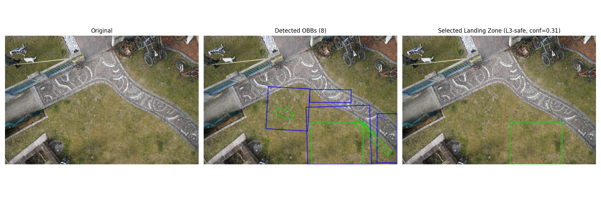

# UAV-Seg2Det-SafeLanding
A lightweight object detection approach to UAV safe landing from semantic segmentation data.

This project converts the ICG Semantic Drone Dataset into an Oriented Object Detection dataset for Safe Landing Zone (SLZ) detection. The repo also provides a training pipeline for YOLO based detectors on the OBB dataset. To convert the semantic dataset into an SLZ detection dataset we first generate the graded safety masks which assign each pixel a level of safety. Then we perform the Seg2Det conversion algorithm to convert the safety masks to Oriented Bounding Boxes. The safety masks, OBB labels, manually curated altitude labels, and the trained weights are provided publicly here.

## Quick Start

The repo provides a quick script and the weights needed for testing out the inference of the SLZ detection model, but first you will need to setup the environment and install the needed libraries. Then you can download the pretrained weights and run the inference script.

### Installation

1. Install [Python](https://www.python.org/downloads/). It's better to install and use [Anaconda](https://www.anaconda.com/download) to manage your environment.
2. Install PIP, make sure it's the latest pip (only using python3) **(if you are not going with the anaconda route)**

   ```bash
   python3 --version
   curl https://bootstrap.pypa.io/get-pip.py -o get-pip.py
   python3 get-pip.py
   python3 -m pip install --upgrade pip
   ```

3. Install the [CUDA Toolkit](https://developer.nvidia.com/cuda-toolkit) for GPU accelaration. If you do not have a nvidia GPU you can skip this and run the project with your CPU.
4. Install pytorch from their [site](https://pytorch.org/) and select the os and cuda version you're running on. Example:

   `conda install pytorch==2.0.1 torchvision==0.15.2 torchaudio==2.0.2 pytorch-cuda=11.7 -c pytorch -c nvidia`

   If you are not running CUDA:

   `pip3 install torch torchvision torchaudio`

5. Set up a jupyter kernel to run the .ipynb notebooks.

   ```bash
   pip install jupyter
   python -m ipykernel install --user --name myenv
   ```

6. Clone this repo, pip Install the requirements file

   `pip install -r requirements.txt`

### Pretrained weights

Download one of the pretrained weights and place it under `pretrained/`.

| **Model**                                                                                              | **size(pixels)** | **mAP@50** | **SLS@L2** | **FSR**  | **mIoA** | **FLOPs(G)** |
|----------------------------------------------------------------------------------------------------|--------------|--------|--------|------|------|----------|
| [YOLO11s](https://drive.google.com/drive/folders/13TYxmLyoysL-5L8g54hJz5EgQWq1K8Jk?usp=drive_link) | 1920         | 0.25   | 0.825  | 0.03 | 0.87 | 22.3     |
| [YOLO11n](https://drive.google.com/drive/folders/1yN9NWBrCqGakqvxYC_SOL_YVYkFs7lKS?usp=sharing)    | 1280         | 0.28   | 0.75   | 0.05 | 0.85 | 6.6      |
| [YOLO8n](https://drive.google.com/drive/folders/1HvMBIkEWKGQbt61wHnO9mU7FB0K4LunN?usp=drive_link)  | 1280         | 0.22   | 0.75   | 0.07 | 0.81 | 8.4      | 

You should end up with this:
```
pretrained
   L weights
      L best.pt
      L last.pt
```

### Inference

Run the inference script on any drone image by passing its path as the argument:

```bash
python detect_landing.py path/to/your/image.jpg
```

The script will load the model from `pretrained/weights/best.pt` by default. You can override this with `--weights`:

```bash
python detect_landing.py path/to/your/image.jpg --weights pretrained/weights/best.pt
```

Additional optional arguments:

| Argument | Default | Description |
|---|---|---|
| `--weights` | `pretrained/weights/best.pt` | Path to model weights |
| `--imgsz` | `1920` | Inference image size (use `1280` for nano models) |
| `--conf` | `0.25` | Confidence threshold |

A window will pop up showing three panels side by side:

- **Original** — the input image as-is
- **Detected OBBs** — all predicted oriented bounding boxes (blue = L2-safe, green = L3-safe)
- **Selected Landing Zone** — the single best landing zone chosen by the selection algorithm (L3 preferred over L2, then largest area, then highest confidence)

**Example output:**



##  Dataset

This project uses the ICG semantic drone dataset which can be found [here](https://ivc.tugraz.at/research-project/semantic-drone-dataset/).

Download the dataset and place it under `Data/` to have the following structure:

```
Data
   L code
      L loadBoundingBoxes.pt
   L training_set
      L gt
      L images
...
```

## Repo Content

The workspace contains the following key files and directories:

1. `exploring.ipynb`: This file walks through:
   1. Loading of the ICG dataset
   2. Estimating the altitudes of the images to get the ground sampling distance (m/px)
   3. Safety mask generation.
   4. The step by step process of converting a safety mask to ground truth safe landing OBBs
2. `label_altitudes.py`: a GUI tool for manually reviewing the altitude estimates generated.
    1. We provide our manually curated altitude labels for the dataset [here](https://drive.google.com/file/d/1x_1rjhqN3YvGJkN_gRwbCEWMkhFM7d66/view?usp=drive_link). Place this csv file here: `Data/training_set/slz_out/altitude/altitude_final.csv`.
3. `src/slz_seg2det_obb_full.py`:  The script to convert the entire safety masks set to Oriented Bounding Boxes.
4. `detection.ipynb`: A notebook that goes through the training pipeline for the YOLO based detectors
5. `evaluation.ipynb`: Evaluating the detectors based on Object Detection and Safe Landing Metrics.
6. `compare`: a directory containing training and evaluation code for other approaches in the literature.
7. `detect_landing.py`: Inference script

The produced Safety Masks and Oriented Bounding Box labels can be downloaded from [here](https://drive.google.com/drive/folders/1JvvfLokSNnK8WAC25DzEO2hy-mBHtUKm?usp=drive_link)

Place the files in the following manner for the scripts to run smoothly:

```
Data
   L code
      L loadBoundingBoxes.pt
   L training_set
      L gt
         L bounding_box
         L semantic
      L images
         L 000.jpg
         L ...
      L slz_out
         L det_obb
            L labels_yolo_obb (yolo format)
               L 000.txt
               L ...
            L slz_obb_all.json (coco format)
         L masks_levels
            L 000_levels.png
            L ...
         L altitude
            L altitude_final.csv
...
```
